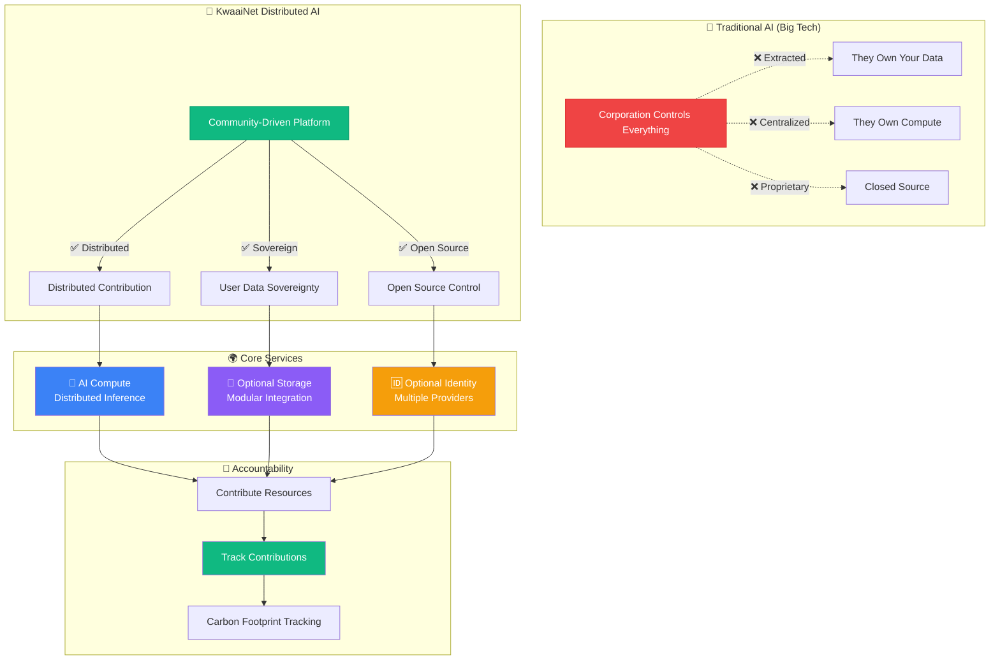
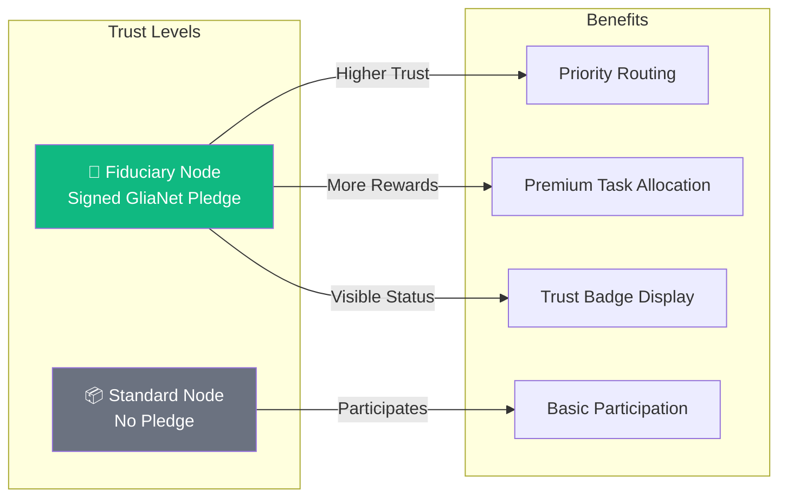

<div align="center">
  
</div>

# KwaaiNet: Sovereign AI Infrastructure

> Building the world's first decentralized AI platform where users own their compute, storage, and data

## Contents

- [Download](#download)
- [Status](#-status-network-live--operational)
- [Quick Start](#kwaainet--native-rust-cli)
- [Vision](#vision)
- [GliaNet Fiduciary Pledge](#guiding-principles-glianet-fiduciary-pledge)
- [Decentralized Trust Graph](#decentralized-trust-graph-dtg)
- [Architecture](#architecture)
- [Development Roadmap](#development-roadmap)
- [Documentation](#-documentation)

---

## Download

Pre-built binaries are attached to every [GitHub Release](https://github.com/Kwaai-AI-Lab/KwaaiNet/releases/latest) — no Rust or Go toolchain required.

| Platform | Download |
|----------|----------|
| macOS — Apple Silicon (M1/M2/M3/M4) | `kwaainet-vX.Y.Z-aarch64-apple-darwin.tar.gz` |
| macOS — Intel | `kwaainet-vX.Y.Z-x86_64-apple-darwin.tar.gz` |
| Linux — x86_64 | `kwaainet-vX.Y.Z-x86_64-unknown-linux-gnu.tar.gz` |
| Windows — x86_64 | `kwaainet-vX.Y.Z-x86_64-pc-windows-msvc.zip` |

**macOS / Linux — one-liner install:**
```bash
# Apple Silicon example — replace the filename for your platform
curl -L https://github.com/Kwaai-AI-Lab/KwaaiNet/releases/latest/download/kwaainet-aarch64-apple-darwin.tar.gz \
  | tar -xz && sudo mv kwaainet /usr/local/bin/
kwaainet setup
```

**Windows (PowerShell):**
```powershell
Invoke-WebRequest -Uri https://github.com/Kwaai-AI-Lab/KwaaiNet/releases/latest/download/kwaainet-x86_64-pc-windows-msvc.zip -OutFile kwaainet.zip
Expand-Archive kwaainet.zip -DestinationPath .
# Move kwaainet.exe to a directory on your PATH
```

After installing, jump to [Quick Start](#kwaainet--native-rust-cli).

> Want to build from source instead? See [Building from Source](#quick-setup-all-platforms).

---

## ✅ Status: Network Live & Operational

**Latest Achievements:**
- ✅ **Decentralized Trust Graph** — `kwaai-trust` crate implements the ToIP/DIF DTG framework: W3C Verifiable Credentials, `did:peer:` DIDs derived from libp2p PeerIds, Ed25519 signature verification, credential storage at `~/.kwaainet/credentials/`, weighted trust scoring with time-decay, and `kwaainet identity` CLI commands. Trust attestations are included in DHT announcements; map.kwaai.ai can now display trust badges alongside nodes
- ✅ **Persistent Node Identity** — each node generates and stores a permanent Ed25519 keypair at `~/.kwaainet/identity.key`; the same `PeerId` (and `did:peer:`) is used across restarts, making Verifiable Credentials meaningful
- ✅ **Bootstrap Resilience** — node announces to all configured bootstrap peers in parallel; if the primary is down the secondary takes over automatically, so `kwaainet start` succeeds even when `bootstrap-1` is unreachable
- ✅ **`kwaainet start --daemon`** — one command starts a fully managed background node, confirmed **online** on [map.kwaai.ai](https://map.kwaai.ai)
- ✅ **`kwaainet serve`** — OpenAI-compatible API server (`/v1/models`, `/v1/chat/completions`, `/v1/completions` with SSE streaming); any OpenAI client library works out of the box
- ✅ **GGUF Tokenizer Special Tokens Fixed** — control tokens (e.g. `<|eot_id|>`) are now registered as `added_tokens` in the HuggingFace tokenizer; generation stops correctly at EOS instead of running to the token limit and leaking raw special-token strings into responses
- ✅ **Native Rust CLI** — `kwaainet` binary runs nodes directly via `kwaai-p2p` + `kwaai-hivemind-dht` (no Python required)
- ✅ **Smart Model Selection** — reads the live network map at startup, cross-references locally installed Ollama models, and auto-selects the best model to serve (most popular on the network that you have locally)
- ✅ **Canonical DHT Prefix** — uses the map's official `dht_prefix` (e.g. `Llama-3-1-8B-Instruct-hf`) so your node joins the correct swarm instead of creating a broken separate entry
- ✅ **Metal GPU Inference** — native Apple Silicon GPU acceleration via candle + Metal; **33+ tok/s** on M4 Pro with GGUF Q4_K_M
- ✅ **`kwaainet benchmark`** — fast throughput measurement (warm-up + 20 timed decode steps, completes in <1 s) saved to cache for accurate DHT announcements
- ✅ **Direct Connection Detection** — announces `using_relay: false` when a public IP is configured, giving full throughput credit on the map
- ✅ **Full Petals/Hivemind DHT Compatibility** — DHT announcements, RPC health checks, 120-second re-announcement
- ✅ **Cross-Platform Support** — Tested on macOS ARM64, Linux, and Windows
- 🌐 **Live Node**: `KwaaiNet-RUST-Node` serving `Llama-3.1-8B-Instruct` blocks 0–7 at **33.2 tok/s**

**What This Means:** A single `kwaainet start --daemon` command reads the network map, picks the best locally-available model, and launches a production-ready distributed AI node in the background. The node joins the correct DHT swarm, responds to health monitor RPC queries, and stays visible on the network map — all in native Rust, no Python required.

## Vision

KwaaiNet is creating a new paradigm for AI infrastructure - one where users maintain complete sovereignty over their computational contributions and personal data. We're building an open-source distributed AI platform that combines:

- **Decentralized AI Compute**: Distributed inference across millions of devices
- **Privacy-First Architecture**: User-controlled data processing
- **Modular Integration**: Support for various storage/identity systems
- **Environmental Accountability**: Carbon-negative computing tracking

KwaaiNet is open-source infrastructure built collaboratively and owned by no single entity.

https://youtu.be/ES9iQWkAFeY



**The shift is simple**: Instead of Big Tech controlling AI infrastructure, the community builds and maintains it collaboratively.

---

## Guiding Principles: GliaNet Fiduciary Pledge

Kwaai is a proud signatory of the [**GliaNet Fiduciary Pledge**](https://www.glianetalliance.org/pledge), committing KwaaiNet to the highest standards of user protection. This pledge becomes a foundational principle for the entire network.

### The PEP Model

| Duty | Commitment | How KwaaiNet Honors It |
|------|------------|----------------------|
| **🛡️ Protect** (Guardian) | Safeguard user data and well-being | E2E encryption, user-controlled keys, data minimization, no data leaves without consent |
| **⚖️ Enhance** (Mediator) | Resolve conflicts favoring users | No surveillance, no profiling, no third-party data sharing, privacy-by-design |
| **📣 Promote** (Advocate) | Advance user interests proactively | Token rewards, transparent governance, open source, user sovereignty first |

### Node Operator Trust Hierarchy

The GliaNet Fiduciary Pledge is **optional for node operators** but directly impacts network trust:



**Fiduciary Nodes** that sign the pledge receive:
- 🏅 **Trust Badge**: Visible "GliaNet Fiduciary" status on the network map
- ⚡ **Priority Routing**: Preferred for sensitive/enterprise workloads
- 🎯 **Enhanced Reputation**: `FiduciaryPledgeVC` adds 0.30 to the node's trust score (the single highest-weight credential)
- 🤝 **Enterprise Eligibility**: Required for GDPR/HIPAA compliant workloads

The pledge is enforced via the trust graph: signing generates a `FiduciaryPledgeVC` issued by the GliaNet Foundation and stored in the node's credential wallet. The credential travels with the node in every DHT announcement. Violation triggers VC revocation, immediately dropping the node's trust score.

> *"By signing the GliaNet Fiduciary Pledge, node operators commit to putting users first—protecting their data, enhancing their experience, and promoting their interests above all else."*

---

## Decentralized Trust Graph (DTG)

KwaaiNet implements the [ToIP/DIF Decentralized Trust Graph](https://trustoverip.org) framework — a four-layer model that gives every node a portable, verifiable reputation without any central authority.

### Layer 1 — Identity (already live)

Every node's libp2p `PeerId` (Ed25519 keypair) is a self-certifying identity anchor, functionally equivalent to a `did:key`. KwaaiNet exposes it as a `did:peer:` DID:

```
did:peer:QmYyQSo1c1Ym7orWxLYvCuxRjeczyuq4GNGbMaFfkMhp4
```

The keypair is persisted at `~/.kwaainet/identity.key` so the DID is stable across restarts.

### Layer 2 — Verifiable Credentials

Credentials are cryptographically signed W3C VCs, stored at `~/.kwaainet/credentials/` and included in DHT announcements.

| Credential | Issuer | What it proves | Phase |
|------------|--------|----------------|-------|
| `SummitAttendeeVC` | Kwaai summit server | Attended a Kwaai Personal AI Summit | **1 — live** |
| `FiduciaryPledgeVC` | GliaNet Foundation | Signed the GliaNet Fiduciary Pledge | 2 — Q2 2026 |
| `VerifiedNodeVC` | Kwaai Foundation | Passed node onboarding checks | 2 — Q2 2026 |
| `UptimeVC` | Bootstrap servers | Observed uptime ≥ threshold over N days | 3 — Q3 2026 |
| `ThroughputVC` | Peer nodes | Peer-witnessed throughput within X% of announced | 3 — Q3 2026 |
| `PeerEndorsementVC` | Any node | "I have transacted with this node reliably" | 4 — Q3 2026 |

### Layer 3 — Trust Scoring

```
NodeTrustScore = Σ weight(VC_type) × 0.5^(age_days/365)
```

| Score | Tier | Typical credentials |
|-------|------|---------------------|
| ≥ 0.70 | **Trusted** | FiduciaryPledge + VerifiedNode + Uptime |
| ≥ 0.40 | **Verified** | VerifiedNode present |
| ≥ 0.10 | **Known** | SummitAttendee or similar |
| < 0.10 | **Unknown** | No recognised credentials |

Scores are **local to the querier** — your trust graph may differ from mine. A node's earned VCs travel with it if it changes infrastructure. Phase 4 adds full EigenTrust propagation (Sybil-resistant through endorsement-weight decay).

### Layer 4 — Governance

- **Trusted issuers**: GliaNet Foundation (FiduciaryPledge), Kwaai Foundation (VerifiedNode), bootstrap servers (Uptime/Throughput)
- **Revocation**: `FiduciaryPledgeVC` can be revoked if the pledge is violated
- **Enterprise routing**: minimum trust score thresholds for HIPAA/GDPR workloads (Q2 2026)

### `kwaainet identity` commands

```bash
# Show this node's DID, Peer ID, trust tier, and credentials
kwaainet identity show

# Import a Verifiable Credential (e.g., from a Kwaai summit)
kwaainet identity import-vc summit-attendee-vc.json

# List all stored credentials
kwaainet identity list-vcs

# Verify a credential's structure and Ed25519 signature
kwaainet identity verify-vc some-credential.json
```

### Summit on-ramp (Phase 1 demo path)

```
1. Scan QR at Kwaai Personal AI Summit
         ↓
2. Register → receive SummitAttendeeVC (signed by summit server)
         ↓
3. kwaainet identity import-vc summit-attendee-vc.json
         ↓
4. kwaainet start  →  node announces with trust_attestations in DHT
         ↓
5. map.kwaai.ai shows trust badge next to your node
```

---

## Architecture

KwaaiNet represents a fundamental shift from traditional centralized AI to a **triple-service sovereign model**:

```rust
pub struct DistributedAINode {
    // AI Compute Services
    inference_engine: CandelEngine,          // Rust/WASM inference
    p2p_network: P2PNetwork,                 // WebRTC mesh networking

    // Optional Integrations
    storage: Option<StorageProvider>,        // Pluggable storage (Verida, Solid, IPFS, Filecoin, etc.)
    identity: Option<IdentityProvider>,      // Pluggable identity systems (DIDs, WebAuthn, etc.)
    encryption_layer: E2EEncryption,         // End-to-end encryption

    // Tracking & Accountability
    carbon_tracker: EnvironmentalMetrics,    // Energy source detection
    contribution_tracker: ResourceMetrics,   // Resource contribution tracking
}
```

## Core Components

### 🦀 **Core Engine** (`/core`)
Rust/WASM universal runtime that deploys everywhere:
- Browser (WebAssembly + WebRTC)
- Mobile (Native iOS/Android)
- Desktop (Single binary)
- Embedded (ARM/MIPS cross-compile)

### 🌐 **Browser SDK** (`/browser-sdk`)
One-line website integration for sovereign AI:
```javascript
<script src="https://cdn.kwaai.ai/sovereign-ai.js" 
        data-services="compute,storage,identity,carbon"
        data-privacy-compliant="gdpr,ccpa,hipaa">
</script>
```

### 📱 **Mobile Foundation** (`/mobile`)
iOS/Android apps with privacy-first design:
- Background contribution during charging + WiFi
- Battery-aware algorithms
- Progressive authentication (Anonymous → Sovereign)

### 🔗 **Optional Integrations** (`/integrations`)
Modular integration framework for distributed storage and identity systems:
- Distributed storage networks (Verida, Solid, IPFS, Filecoin)
- W3C DID-compliant identity providers
- WebAuthn/PassKeys authentication
- Custom backend adapters

### 🏢 **Enterprise Compliance** (`/compliance`)
Built-in regulatory compliance frameworks:
- GDPR/HIPAA/SOC2 compliance by design
- Audit logging and reporting
- Data residency controls

### 🌱 **Environmental Tracking** (`/environmental`)
Carbon accountability for distributed computing:
- Renewable energy detection
- Carbon footprint tracking
- Green energy marketplace integration
- Energy efficiency monitoring

## Development Roadmap

### Q4 2025: Architecture & Community Preparation
- Technical specification finalization
- Open-source community engagement
- Development infrastructure and governance frameworks

### Q1 2026: Foundation Development
**Core Components:**
1. **Rust/WASM Core Engine** - Universal inference runtime
2. **Optional Integration Framework** - Modular storage/identity support
3. **Browser SDK Development** - One-line website integration
4. **Enterprise Compliance Tools** - GDPR/HIPAA compliance
5. **Mobile Foundation** - iOS/Android native apps
6. **Environmental Tracking** - Carbon accountability

### 2026-2027: Progressive Deployment
- **Q2 2026**: 1K+ nodes (Platform Deployment)
- **Q3 2026**: 10K+ nodes (Market Expansion)
- **Q4 2026**: 100K+ nodes (Enterprise & Edge)
- **2027+**: OS-level integration toward 1B+ nodes

## Community & Governance

### Mission-Driven Development
KwaaiNet is built by and for the community that believes in **democratizing AI**. Our approach:

- **Open Architecture**: Transparent technical specifications and decision-making
- **Community-Driven Development**: Collaborative building with merit-based recognition
- **Quality Gates**: Rigorous review and integration processes
- **Long-term Sustainability**: Open-source governance and community ownership

### Getting Started

#### `kwaainet` — Native Rust CLI

The `kwaainet` binary is a fully native Rust CLI for managing your KwaaiNet node. It requires **no Python** and runs the node directly via the `kwaai-p2p` and `kwaai-hivemind-dht` crates.

**Build:**
```bash
cargo build --release -p kwaai-cli
# Binary at: target/release/kwaainet
```

**First-time setup:**
```bash
kwaainet setup                                     # create dirs, write default config
kwaainet config --set public_ip <YOUR_PUBLIC_IP>   # required for map visibility + direct connection
kwaainet config --set public_name "YourName@kwaai" # shown on the map
kwaainet calibrate --apply recommended             # auto-set block count for your RAM
```

> **Model selection is automatic.** On startup, `kwaainet` reads the live network map, lists your locally installed Ollama models, and picks the best match. No need to set a model manually unless you want a specific one.

**Measure throughput (run once before starting):**
```bash
# Fast benchmark — primes GPU caches, measures 20 decode steps, saves to cache
kwaainet benchmark
# → Throughput: 33.2 tok/s  (saved to ~/.kwaainet/throughput_cache.json)
```

**Serve the OpenAI-compatible API:**
```bash
# Load your Ollama model and start the API server (default port 11435)
kwaainet serve

# Use a specific model or port
kwaainet serve llama3.1:8b --port 11434

# Test with curl
curl http://localhost:11435/v1/models
curl http://localhost:11435/v1/chat/completions \
  -H "Content-Type: application/json" \
  -d '{"model":"llama3.1:8b","messages":[{"role":"user","content":"Hello!"}]}'

# Works with any OpenAI client library — just set base_url:
# openai.base_url = "http://localhost:11435/v1"
```

**Running a node:**
```bash
# Start as a background daemon (recommended)
kwaainet start --daemon

# Check status
kwaainet status

# View logs
kwaainet logs --follow

# Stop the node
kwaainet stop

# Force a specific model (skip map auto-selection)
kwaainet start --model llama3.1:8b --daemon
```

**What happens when you `kwaainet start`:**
1. 🗺  Fetches the live network map from [map.kwaai.ai](https://map.kwaai.ai)
2. 🔍 Lists locally installed Ollama models
3. 🤖 Selects the locally-available model with the most active network servers
4. 💾 Saves the canonical DHT prefix (e.g. `Llama-3-1-8B-Instruct-hf`) to config
5. 🔑 Loads (or generates) the persistent identity keypair from `~/.kwaainet/identity.key`
6. 📜 Loads valid Verifiable Credentials from `~/.kwaainet/credentials/` for this node's DID
7. 🚀 go-libp2p-daemon spawns with the persistent keypair (`-id`), same PeerId every run
8. 🔗 Registers Hivemind RPC handlers (`rpc_ping`, `rpc_store`, `rpc_find`)
9. ⏳ Waits 30 s for DHT bootstrap connections to stabilise
10. ⚡ Measures network bandwidth; computes `effective_tps = min(compute, network)`
11. 📡 Announces blocks + model info + trust attestations to all bootstrap peers (falls back to secondary if primary is down)
12. ✅ Node appears on [map.kwaai.ai](https://map.kwaai.ai) under the right model (with trust badge if credentials present)
13. 🔄 Re-announces every 120 s to stay visible

**Configuration:**
```bash
kwaainet config --view                              # print current config
kwaainet config --set blocks 8
kwaainet config --set port 8080
kwaainet config --set public_ip 203.0.113.1        # your external IP (enables direct connection)
kwaainet config --set public_name "MyNode@kwaai"
```

**Full command reference:**

| Command | Description |
|---------|-------------|
| `kwaainet start [--daemon]` | Start the node (reads map, auto-selects model, foreground or background) |
| `kwaainet start --model <m>` | Start with a specific model (skips map auto-selection) |
| `kwaainet stop` | Stop the daemon |
| `kwaainet restart` | Restart the daemon |
| `kwaainet status` | Show PID, CPU%, memory, uptime |
| `kwaainet logs [--follow] [--lines N]` | View daemon logs |
| `kwaainet config --view` | Print current config |
| `kwaainet config --set KEY VALUE` | Update a config value |
| `kwaainet serve [model] [--port N]` | OpenAI-compatible API server (`/v1/chat/completions`, SSE streaming) |
| `kwaainet benchmark [--steps N]` | Measure decode throughput and save to cache |
| `kwaainet generate <model> <prompt>` | Run a full generation (also saves throughput) |
| `kwaainet calibrate [--apply min\|recommended\|max]` | Estimate optimal block count for your RAM |
| `kwaainet service install\|uninstall\|status` | Manage auto-start service (launchd/systemd) |
| `kwaainet health-status\|health-enable\|health-disable` | Health monitoring |
| `kwaainet monitor stats\|alert` | P2P connection statistics and alerts |
| `kwaainet update [--check]` | Check for new releases |
| `kwaainet setup` | Initialize directories and default config |
| `kwaainet identity show` | Show node DID, Peer ID, trust tier, and credential summary |
| `kwaainet identity import-vc <file>` | Import a Verifiable Credential from a JSON file |
| `kwaainet identity list-vcs` | List all stored Verifiable Credentials |
| `kwaainet identity verify-vc <file>` | Verify a credential's structure and Ed25519 signature |

**Node appears on the network map within 30–60 seconds of starting.**
Check it at: **[map.kwaai.ai](http://map.kwaai.ai)**

---

#### Quick Setup (All Platforms)

**Automated setup scripts handle all prerequisites:**

**Linux / macOS:**
```bash
chmod +x setup.sh
./setup.sh
cargo build
cargo run --example petals_visible
```

**Windows (PowerShell):**
```powershell
powershell -ExecutionPolicy Bypass -File setup.ps1
cargo build
cargo run --example petals_visible
```

The setup scripts automatically install:
- ✅ **Rust** 1.80+ (for edition2024 support)
- ✅ **Go** 1.20+ (for go-libp2p-daemon)
- ✅ **Git** (for repository management)
- ✅ **System tools** (curl, unzip, etc.)

**Manual Prerequisites (if needed):**

| Tool | Minimum Version | Purpose |
|------|----------------|---------|
| [Rust](https://rustup.rs/) | 1.80+ | Core codebase |
| [Go](https://golang.org/dl/) | 1.20+ | p2p daemon |
| [Git](https://git-scm.com/) | Any recent | Version control |

#### Build System Architecture

KwaaiNet uses a **multi-tiered cross-platform build system**:

1. **build.rs automation** - Handles platform detection, downloads binaries, compiles dependencies
2. **Platform-specific scripts** - `setup.sh` (Linux/macOS), `setup.ps1` (Windows)
3. **Cargo workspace** - Unified build across all crates

**Key cross-platform features:**
- Auto-detects OS (Windows/Linux/macOS) and architecture (x86_64/aarch64)
- Downloads platform-specific protoc compiler automatically
- Builds go-libp2p-daemon using system Go toolchain
- Handles Windows (TCP) vs Unix (socket) IPC automatically
- Cleans up stale resources (Unix sockets, etc.)

**For Developers:**
1. Review [ARCHITECTURE.md](./ARCHITECTURE.md) for technical specifications
2. Explore the [detailed architecture diagrams](#-documentation) below
3. Check [INTEGRATIONS.md](./INTEGRATIONS.md) for modular integration options
4. Follow [CONTRIBUTING.md](./CONTRIBUTING.md) for development guidelines
5. See [CONTRIBUTORS.md](./CONTRIBUTORS.md) for the contributor list and open TODO items
6. Join community discussions and collaboration channels

**For Users:**
- Browser extension (Coming Q2 2026)
- Mobile apps (Coming Q2 2026)
- Website integration SDK (Coming Q2 2026)

---

## 📚 Documentation

### Architecture Overview
| Document | Description |
|----------|-------------|
| [ARCHITECTURE.md](./ARCHITECTURE.md) | High-level system architecture and component specifications |
| [INTEGRATIONS.md](./INTEGRATIONS.md) | Optional integration framework for storage and identity systems |

### Detailed Architecture Diagrams

| Document | Diagrams | Coverage |
|----------|----------|----------|
| [Component Architectures](./docs/CHALLENGE_ARCHITECTURES.md) | 24 | Technical diagrams for all core components |
| [Data Flows](./docs/DATA_FLOWS.md) | 16 | Authentication, personal data, privacy patterns |
| [Deployment Architecture](./docs/DEPLOYMENT_ARCHITECTURE.md) | 18 | Browser, mobile, desktop, edge, enterprise patterns |
| [Verida Architecture](./docs/VERIDA_ARCHITECTURE.md) | 14 | Protocol bridge, identity, storage, security |

### Technical Deep Dives
| Document | Description |
|----------|-------------|
| [Candle Engine](./docs/CANDLE_ENGINE.md) | Rust/WASM inference engine technical details |
| [Hivemind Rust Architecture](./docs/HIVEMIND_RUST_ARCHITECTURE.md) | Distributed deep learning patterns (MoE, DHT, parameter averaging) |
| [Verida Integration](./docs/VERIDA_INTEGRATION.md) | Optional Verida Network integration example |
| [Debugging Map Visibility](./docs/DEBUGGING_MAP_VISIBILITY.md) | Why Rust nodes don't appear on map.kwaai.ai and how to fix it |

## License

This project is open source under [MIT License](./LICENSE) - building digital public infrastructure for humanity.

---

**"The future of AI is distributed - built by the community, for the community."**

*Building the BitTorrent of AI, one node at a time.*
