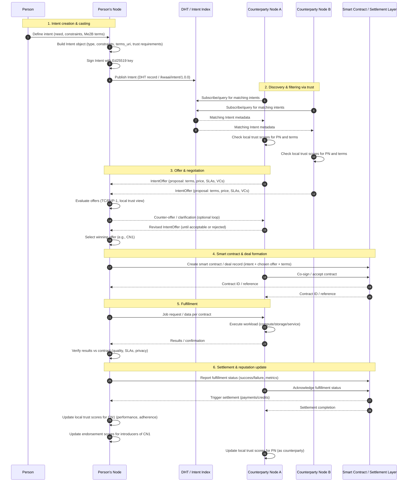

# Network and intent routing

_Audience: protocol researchers, application developers, node operators_

KwaaiNet's network layer provides a credibly neutral **Layer 8 business protocol** on top of a standard libp2p P2P fabric. It combines node discovery and DHT-based record distribution (sections 1–4, to be expanded) with a full intent lifecycle: creation, discovery, negotiation, smart contract formation, fulfillment, and settlement (section 5).

> **Related docs:**
> - [`reputation.md`](reputation.md) — how local trust scores and EigenTrust propagation work
> - [`docs/roadmap.md`](roadmap.md) — network and intent-casting gaps and contribution ideas

---

## 1. P2P transport layer _(to be expanded)_

KwaaiNet uses **libp2p** with:

- **Kademlia DHT** (Hivemind-compatible) for node discovery and distributed record storage.
- **Circuit relay** for residential NAT traversal.
- **Yamux** for stream multiplexing.

---

## 2. DHT records and node announcement _(to be expanded)_

Each node announces itself and its capabilities to the DHT on startup and re-announces every 120 seconds. Records include:

- Model identity, block range, and throughput.
- Trust attestations (VC summaries).
- VPK capability (if enabled).

---

## 3. Trust-gated routing _(to be expanded)_

When routing inference requests, nodes filter shard chain candidates by local trust score and declared capability. An intent like "model X, minimum trust tier Verified, max latency Y ms" resolves only to nodes that satisfy all three constraints simultaneously.

---

## 4. Intent-casting protocol _(to be expanded)_

Intent-casting is the Layer 8 business protocol that lets people and agents broadcast machine-readable needs and find verifiable, trust-scored counterparties. The protocol is under active design; the full lifecycle is described in section 5.

---

## 5. Intent flow, negotiation, fulfillment, and settlement

The sequence below shows the full lifecycle of an intent: creation, discovery, negotiation, smart contract formation, fulfillment, and settlement.

### 5.1 Intent creation and casting

A person expresses a need to their own KwaaiNet node — for example, "I need evaluation infrastructure with these privacy and latency guarantees." The node builds a structured Intent object (type, constraints, Me2B-style terms URI, trust requirements), signs it with its Ed25519 key, and publishes it via the `/kwaai/intent/1.0.0` protocol and DHT.

### 5.2 Discovery and trust-based filtering

Provider nodes subscribe to or query the DHT for intents they can satisfy. When they receive metadata about a new intent, they apply their local trust view of the requester (identity, VCs, trust tier, past behavior) and only consider intents that pass their trust and policy filters.

### 5.3 Offer and negotiation

Interested providers respond with `IntentOffer` messages that propose concrete terms (price, SLAs, privacy guarantees) and include supporting credentials. The requester's node evaluates multiple offers using local trust scores and, where appropriate, the Testable Credentials / PVP-1 process to check whether an offer truly satisfies the intent in context. It can counter-offer until both sides converge on acceptable terms, then selects a winning offer.

### 5.4 Smart contract and deal formation

The requester and chosen provider formalize the agreement as a deal with a smart contract or settlement layer. The contract binds the original intent, the accepted offer, and referenced terms/credentials, and both parties sign it. Each side receives a contract ID to use for later audit, settlement, and dispute resolution.

### 5.5 Fulfillment

The requester sends the actual job or data to the provider per the contract. The provider executes the work (compute, storage, or other service) and returns results and any necessary proofs. The requester verifies that behavior matches the agreed quality, performance, and privacy constraints, producing objective evidence about the provider's behavior.

### 5.6 Settlement and reputation update

Both nodes report the outcome to the settlement layer, which triggers the agreed payment or credit flow. Each node then updates its local reputation model: the requester adjusts trust scores for the provider based on performance and contract adherence, and may also update endorsement scores for any introducers who recommended the provider; the provider can similarly update its view of the requester as a counterparty. Over time, these local updates feed into EigenTrust-style propagation and shape future routing and matching decisions in the KwaaiNet trust fabric.

See [`reputation.md`](reputation.md) for how these local score updates interact with the broader trust fabric.
