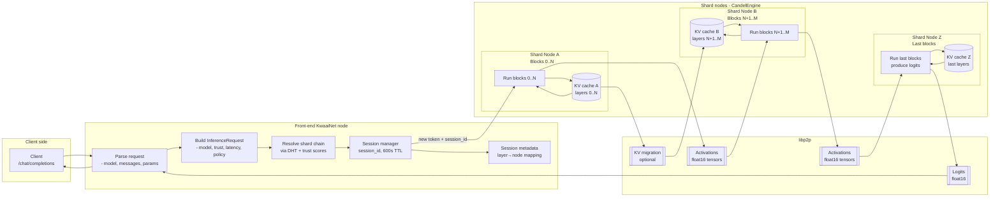
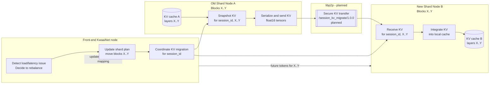

# Sharded LLM processing in KwaaiNet

KwaaiNet's CandelEngine turns a large transformer model into a network of cooperating nodes by sharding the model into blocks and forwarding activations (and, when needed, KV cache segments) between them. From the app's view it looks like a normal chat-completion API; under the hood it is a trust-gated, block-sharded inference pipeline.

---

## 1. Block-sharded model layout

CandelEngine implements Petals-style block-sharded inference:

- A transformer model is split into contiguous blocks (groups of layers) and stored as SafeTensors snapshots.
- Each block (or contiguous range of blocks) is hosted by one KwaaiNet node, which advertises its shard responsibility via the DHT.
- A **shard chain** is an ordered list of nodes that, taken together, cover all blocks needed for a forward pass.

**Example:**

> Blocks 0–7 on Node A, 8–15 on Node B, 16–23 on Node C, 24–31 on Node D.
> A single inference step flows A → B → C → D, with each node applying its blocks and forwarding activations.

---

## 2. Request lifecycle: from API call to shard chain

When a client calls `POST /v1/chat/completions` on a KwaaiNet node:

1. The front-end node parses the request (model ID, messages, sampling params).
2. It constructs an `InferenceRequest` intent including model, minimum trust tier, latency budget, and any policy constraints.
3. Using the DHT and its local trust scores, it resolves this intent into a shard chain of eligible nodes that together host the full model.
4. It initializes or resumes a session KV cache for this conversation, then sends the first hop of the request via the `/kwaai/inference/1.0.0` libp2p protocol.
5. The request travels along the shard chain until logits are produced at the last node and returned to the front-end for streaming back to the client.

---

## 3. Per-node computation: activations in, activations out

At each shard in the chain, the node performs the same high-level steps:

**Receive** a message containing:
- Session ID.
- Current token(s) to process.
- Incoming hidden state / activations (float16 tensors).
- Any relevant KV cache slices needed for its blocks.

**Run** its assigned transformer blocks using:
- RoPE positional encoding, Grouped Query Attention (GQA), SwiGLU activations.
- Temperature, top-k, top-p, and other sampling parameters, if it is the final shard producing logits.

**Emit** either:
- Updated activations (for intermediate shards).
- Logits and updated activations/KV cache (for the final shard).

Data between shards is serialized as float16 little-endian tensors and sent over libp2p streams.

---

## 4. Session KV cache: structure and behavior

### 4.1 What the KV cache stores

For each session (chat), CandelEngine maintains a KV cache that stores attention keys and values for each past token and each attention head in each layer.

- Stored in a `HashMap<session_id, Session>`, where each `Session` holds a `Vec<Option<(K, V)>>` — one slot per block in the shard's assigned range. New tokens are appended along the sequence dimension of each K/V tensor rather than indexed by token position.
- Purpose: avoid recomputing attention over the entire history for every new token.
- TTL: **600 seconds**, after which entries may be evicted and the session considered cold.

### 4.2 Where the KV cache lives

The front-end node owns the session and is responsible for:
- Generating `session_id`.
- Tracking TTL and eviction.
- Managing cache metadata (which layers live where).

Actual KV tensors are stored:
- **Locally** on the front-end for layers it hosts.
- **On shard nodes** for the layers they host.

This allows each node to keep the KV it needs for its block range, minimizing cross-network KV traffic in the common case.

---

## 5. KV cache transfer between nodes

### 5.1 Stateless activations, stateful KV per shard

In the default design, each shard node maintains KV for its own layers locally:

- For a given session and token step, the first shard receives the new token, its own KV slices (already on that node), and the incoming activations.
- It updates its KV cache and forwards **only activations** (not KV) to the next shard.
- The next shard uses its own locally stored KV plus incoming activations to compute its blocks and forwards updated activations onwards.

In this pattern, KV does not travel between nodes on every token — only activations do.

### 5.2 KV migration and rebalancing _(partially aspirational)_

The gap-filling rebalancer (with 0–60 s per-node jitter derived from the last byte of the node's peer ID) is implemented in `shard_cmd.rs` and handles shifting block assignments across nodes.

However, **live KV migration between nodes for active sessions is not yet implemented**. When a block range moves to a new node during an active session, the session's KV for those layers is lost and must be recomputed from context. The migration protocol (`/session_kv_migrate/1.0.0`) and the coordinated transfer flow shown in diagram 6.2 describe the intended future design.

**Intended KV transfer process (planned):**

1. Front-end (or coordinator) decides to remap block range X–Y from Node A to Node B.
2. It instructs Node A to serialize and send its KV entries for `(session_id, layers X–Y)` to Node B over a secure libp2p channel.
3. Node B deserializes and integrates those KV slices into its own cache structure.
4. Subsequent inference steps route the shard chain through Node B for blocks X–Y, using the migrated KV.

---

## 6. Data flow diagrams

### 6.1 Full inference pipeline

### 6.2 KV migration detail _(planned)_

---

## 7. Security and privacy considerations

Because different shards see different parts of the computation, CandelEngine's design explicitly considers attack surfaces:

- A **collusion attack** between the first shard (which sees token IDs) and the last shard (which sees logits) could reconstruct prompt-completion pairs.

Research directions include:

- **Trust-routed inference** — shard selection constrained by trust graph properties so that sensitive workloads only traverse sufficiently trusted nodes.
- **KV cache scrambling** — techniques to obfuscate or partialize KV such that any small subset of shards cannot reconstruct the full prompt or context, while still enabling efficient attention.

Until those mechanisms are fully developed, KwaaiNet emphasizes:

- Person-anchored node identity and legal accountability.
- Transparent trust scores and credentials for nodes participating in inference.
- Clear disclosure of limitations in the whitepaper and docs.

See [`docs/roadmap.md`](roadmap.md) for the compute roadmap items covering decentralized training, KV scrambling, and trust-gated tool-calling.

---

## 8. Summary for developers

**For application developers:**

You call a standard chat-completion API. Underneath, KwaaiNet resolves your request into a shard chain via the trust fabric, streams activations through block-sharded nodes, and manages a 600-second session KV cache across those nodes — mostly local to each shard.

**For protocol and infra contributors**, the key levers are:

- Shard chain construction and trust-aware routing.
- KV cache placement and migration policies.
- Future KV scrambling and confidential-computing integrations to strengthen privacy and security.
